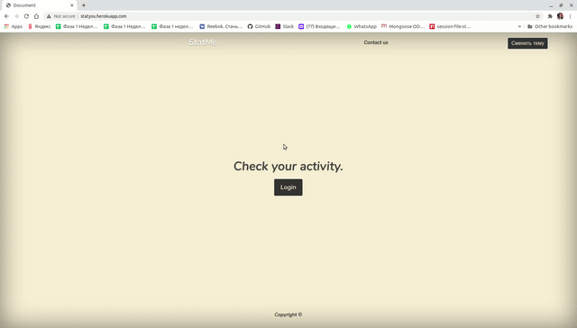
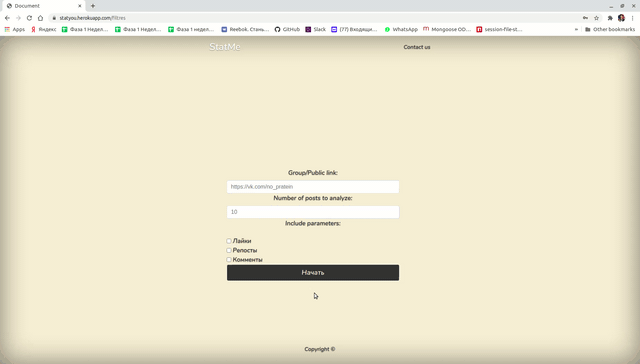

## StatMe
#### App that can form a rating of the most active users of any given group on VK.com

### Light or dark theme:

### Authentication:
VK api used to authenticate users

### Start:
#### 1. Copy/paste the link of any (non-private) group
#### 2. Choose the number of posts to analyze, what type of users' activities to include in results (likes, comments, reposts)

Here are the results of the most active users according to the parameters you have selected previously.
You can click on the ID of any user and be redirected to his/her VK profile page.

#### [Click here to see it in action](http://statyou.herokuapp.com/)

Team:
* [Denis](https://github.com/DenisEps)
* [Ivan](https://github.com/kashtn)
* [Egor](https://github.com/YegorBogdanov)
